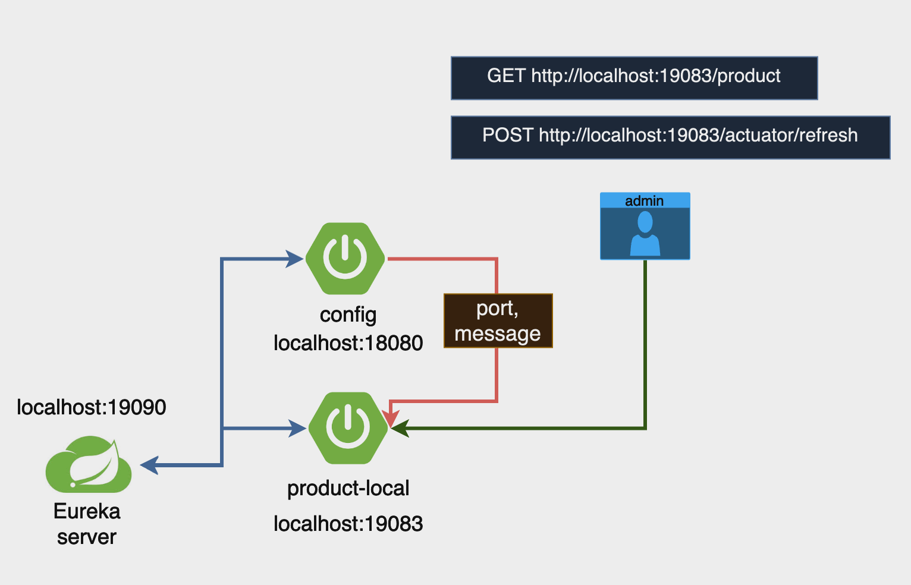

## spring 기본기 레포지토리입니다.

1. spring-prepare : 메모장 CRUD **[입문 1주차]**
2. spring-auth : 스프링 시큐리티를 활용한 JWT 인증/인가 처리 **[숙련 1주차]**
3. spring-resttemplate : RestTemplate을 활용한 서버간에 데이터 통신 **[숙련 2주차]**
4. jpa-advance : JPA 연관관계 설정방법 **[숙련 2주차]**
5. myselectshop : 3,4를 통합하여 My Select Shop 적용 **[숙련 2주차]**, **[심화 1주차]**
   - naver develop client id,pw 필요 (경로 : /myselectshop/naver/service/NaverApiService.java)
   - 더미 데이터 최초 실행시 한번만 동작 하도록 주석 해제 (경로 : /myselectshop/util/TestDataRunner.java)
   - kakao develop REST API 키 필요 (경로 : /resources/templates/login.html, /myselectshop/service/KakaoService.java) 
   - 심화주차 내용 추가 : 소셜 로그인, 테스트, AOP, Global Exception, Error 메시지 관리
6. junit5-practice : 간단한 테스트 방법 자세한건 5번에서 진행 **[심화 1주차]**
7. multi-module : 루트 프로젝트에 여러개의 서브 모듈이 존재하도록 구성 **[개인 공부]**
8. spring-cloud : 스프링 클라우드 환경 관련 패키지 **[MSA 1주차]**
   - loadbalancer : 스프링 클라우드 로드 밸런싱
   - circuitbreaker : 장애 발생 시 요청을 차단하여 서비스 과부하 방지(fallbackOrder 사용)
   - apigateway : api 게이트웨이를 통해 서비스 라우팅
   - auth : jwt 인증/인가 설정, 다이나믹 config 설정
   
     | oauth                                    | config                                                                                                                                                                 |
     |------------------------------------------|------------------------------------------------------------------------------------------------------------------------------------------------------------------------|
     |                |                                                                                                                                            |
     | gateway : JWT 인가한다.  auth : JWT 인증한다. | product 서버는 application.yml파일에서 config 서버의 설정 정보를 가져와서 실행한다.  또한 config 서버의 config 설정이 변경될시 product 서버에서 컨트롤러에 @RefreshScope 애너테이션을 추가함으로 다이나믹 config 정보를 적용할수 있다. |
   - zipkin : 분산추적 설정 docker-compose.yml 실행 필요
   - sample : 기본적인 msa 환경 구축 및 default crud 추가
9. jpashop : 엔티티 관계 설정방법
10. project-manage : docker로 a,b 프로젝트 배포, gitlab으로 aws ecr,ecs 배포 **[프로젝트 관리 1,2주차]**
11. [delievery-management](delievery-management) : 모놀리틱 주문 서비스 프로젝트 [첫번째 프로젝트]
