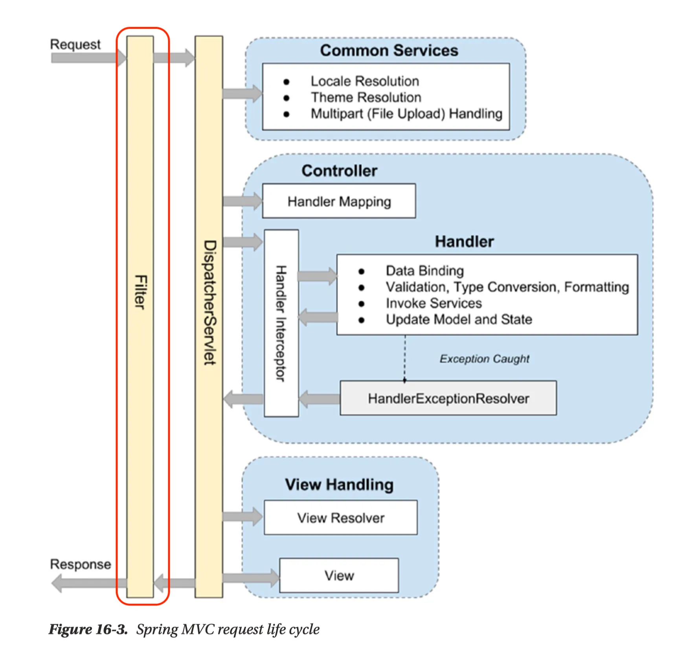
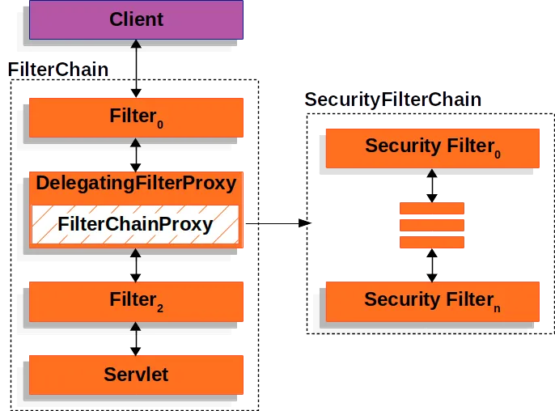
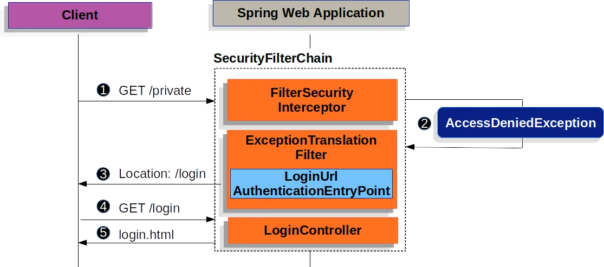
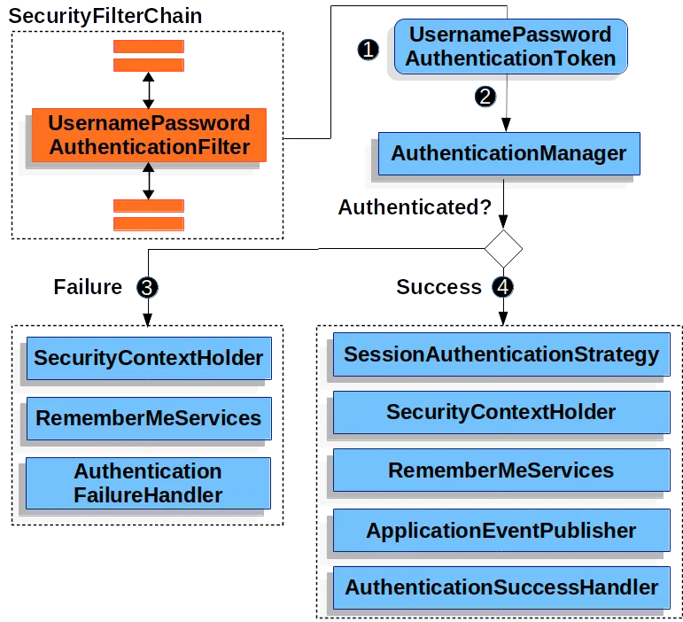
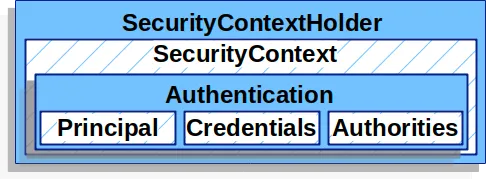
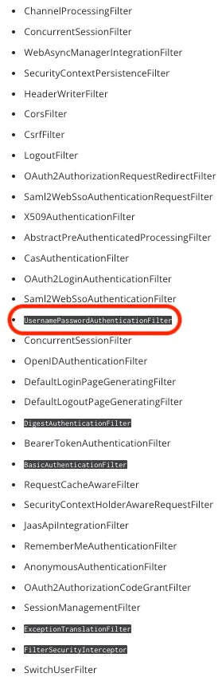

### filter 동작 방식

- Filter란 Web 애플리케이션에서 관리되는 영역으로 Client로 부터 오는 요청과 응답에 대해 최초/최종 단계의 위치이며 이를 통해 요청과 응답의 정보를 변경하거나 부가적인 기능을 추가할 수 있습니다.
- 주로 범용적으로 처리해야 하는 작업들, 예를들어 로깅 및 보안 처리에 활용합니다.
    - 또한 인증, 인가와 관련된 로직들을 처리할 수도 있습니다.
    - Filter를 사용하면 인증, 인가와 관련된 로직을 비즈니스 로직과 분리하여 관리할 수 있다는 장점이 있습니다.
### 필터 체인 동작 방식


- Spring에서 모든 호출은 DispatcherServlet을 통과하게 되고 이후에 각 요청을 담당하는 Controller 로 분배됩니다.
- 이 때, 각 요청에 대해서 공통적으로 처리해야할 필요가 있을 때 DispatcherServlet 이전에 단계가 필요하며 이것이 Filter 입니다.
- Spring Security도 인증 및 인가를 처리하기 위해 Filter를 사용하는데
    - Spring Security는 FilterChainProxy를 통해서 상세로직을 구현하고 있습니다.

### Form Login 기반 인증

- Form Login 기반 인증은 인증이 필요한 URL 요청이 들어왔을 때 인증이 되지 않았다면 로그인 페이지를 반환하는 형태입니다.
### UsernamePasswordAuthenticationFilter

- UsernamePasswordAuthenticationFilter는 Spring Security의 필터인 AbstractAuthenticationProcessingFilter를 상속한 Filter입니다.
- 기본적으로 Form Login 기반을 사용할 때 username 과 password 확인하여 인증합니다.
- 인증 과정
    1. 사용자가 username과 password를 제출하면 UsernamePasswordAuthenticationFilter는 인증된 사용자의 정보가 담기는 인증 객체인 Authentication의 종류 중 하나인  UsernamePasswordAuthenticationToken을 만들어 AuthenticationManager에게 넘겨 인증을 시도합니다.
    2. 실패하면 SecurityContextHolder를 비웁니다.
    3. 성공하면 SecurityContextHolder에 Authentication를 세팅합니다.
### SecurityContextHolder


#### SecurityContext

- SecurityContext는 인증이 완료된 사용자의 상세 정보(Authentication)를 저장합니다.
- SecurityContext는 SecurityContextHolder 로 접근할 수 있습니다.

```
SecurityContext context = SecurityContextHolder.createEmptyContext();
Authentication authentication = new UsernamePasswordAuthenticationToken(principal, credentials, authorities);
context.setAuthentication(authentication); // SecurityContext 에 인증 객체 Authentication 를 저장합니다.

SecurityContextHolder.setContext(context);
```

#### Authentication

- 현재 인증된 사용자를 나타내며 SecurityContext에서 가져올 수 있습니다.
- principal  :  사용자를 식별합니다.
    - Username/Password 방식으로 인증할 때 일반적으로 UserDetails 인스턴스입니다.
- credentials : 주로 비밀번호, 대부분 사용자 인증에 사용한 후 비웁니다.
- authorities : 사용자에게 부여한 권한을 GrantedAuthority로 추상화하여 사용합니다.

```
@Override
public Collection<? extends GrantedAuthority> getAuthorities() {
    UserRoleEnum role = user.getRole();
    String authority = role.getAuthority();

    SimpleGrantedAuthority simpleGrantedAuthority = new SimpleGrantedAuthority(authority);
    Collection<GrantedAuthority> authorities = new ArrayList<>();
    authorities.add(simpleGrantedAuthority);

    return authorities;
}

Authentication authentication = new UsernamePasswordAuthenticationToken(userDetails, null, userDetails.getAuthorities());
```
- UsernamePasswordAuthenticationToken는 Authentication을 implements한 AbstractAuthenticationToken의 하위 클래스로, 인증객체를 만드는데 사용됩니다.
- UserDetailsService는 username/password 인증방식을 사용할 때 사용자를 조회하고 검증한 후 UserDetails를 반환합니다. Custom하여 Bean으로 등록 후 사용 가능합니다.
- 검증된 UserDetails는 UsernamePasswordAuthenticationToken 타입의 Authentication를 만들 때 사용되며 해당 인증객체는 SecurityContextHolder에 세팅됩니다. Custom하여 사용가능합니다.

### Security Filter 순서
