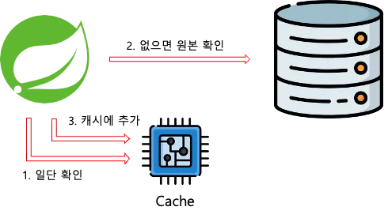
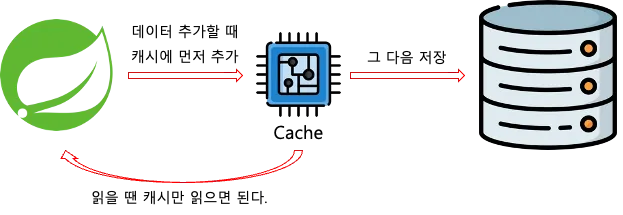

## Redis 활용 레포지토리

- ArticleController : 리더 보드 기능
  - 게시글 점수 증가 (조회수 증가)
  - 게시글에 유저 추가
  - 특정 게시글의 유저 수 조회
  - 가장 인기 있는 게시글 가져오기

- AuthController : 시큐리티를 사용 및 redis 세션 클러스터 구성
  - http://localhost:8080/auth/login 에서 user1/password1로 로그인 가능
  - 세션 정보를 redis에 json 직렬화하고 싶다면 SecurityConfig를 참고

- CartController : 장바구니 추가,조회 및 redis 세션 클러스터 구성
  - 톰캣 서버가 SESSION을 생성 해주는것을 redis에 저장
  - 8080,8081 포트를 옮기면서 해도 세션 유지가능

- ItemController : 랭킹 시스템 및 기본적인 캐시 사용방법
  - purchase시 incrementScore를 통해 가장 많이 구매한 item 정보로 랭킹 순위 매기기
  - pruchase시 바로 db에 저장하지 않고 redis list에 right push후 스케줄러로 behind insert 배치처리
  - 스프링 캐시 매니저를 구현한 Redis 캐시 매니저로 캐싱 기능 추가

- OrderController : CrudRepository를 상속받은 인터페이스 사용으로 Redis도 JPA처럼 CRUD하기
 
- SessionController : 세션 생성 확인 컨트롤러

## 캐싱전략

### Cache-Aside

Lazy Loading이라고도 하며, 데이터를 조회할 때 항상 캐시를 먼저 확인하는 전략입니다. 캐시에 데이터가 있으면 캐시에서 데이터를, 없으면 원본에서 데이터를 가져온 뒤 캐시에 저장합니다.

- 필요한 데이터만 캐시에 보관됩니다.
- 최초로 조회할 때 캐시를 확인하기 때문에 최초의 요청은 상대적으로 오래 걸립니다.
- 반드시 원본을 확인하지 않기 때문에, 데이터가 최신이라는 보장이 없습니다.

### Write-Through

데이터를 작성할때 항상 캐시에 작성하고, 원본에도 작성하는 전략입니다.

- 캐시의 데이터 상태는 항상 최신 데이터임이 보장됩니다.
- 자주 사용하지 않는 데이터도 캐시에 중복해서 작성하기 때문에, 시간이 오래 걸립니다.

### Write-Behind

캐시에만 데이터를 작성하고, 일정 주기로 원본을 갱신하는 방식입니다.

- 쓰기가 잦은 상황에 데이터베이스의 부하를 줄일 수 있습니다.
- 캐시의 데이터가 원본에 적용되기 전 문제가 발생하면 데이터 소실의 위험성이 존재합니다.