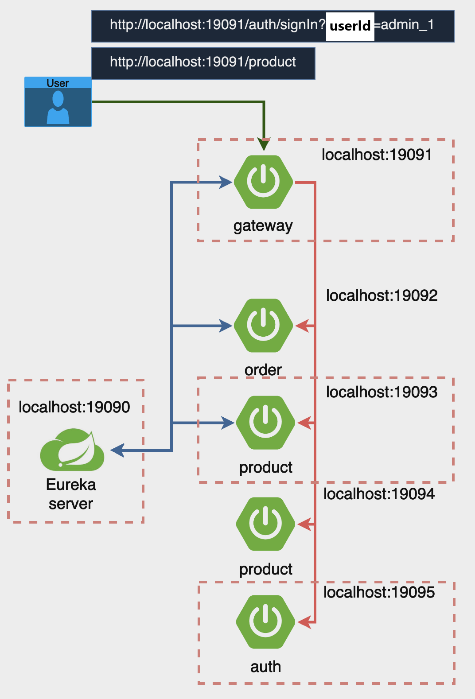
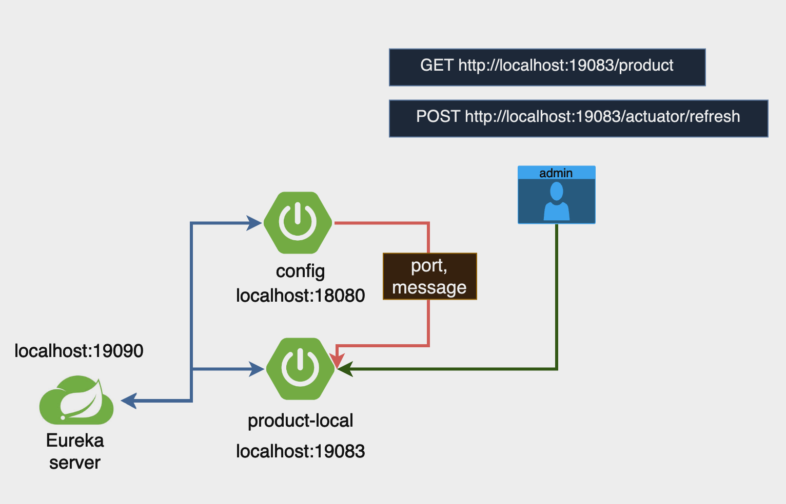

 | oauth                                    | config                                                                                                                                                                 |
 |------------------------------------------|------------------------------------------------------------------------------------------------------------------------------------------------------------------------|
 |                |                                                                                                                                            |
 | gateway : JWT 인가한다.  auth : JWT 인증한다. | product 서버는 application.yml파일에서 config 서버의 설정 정보를 가져와서 실행한다.  또한 config 서버의 config 설정이 변경될시 product 서버에서 컨트롤러에 @RefreshScope 애너테이션을 추가함으로 다이나믹 config 정보를 적용할수 있다. |
